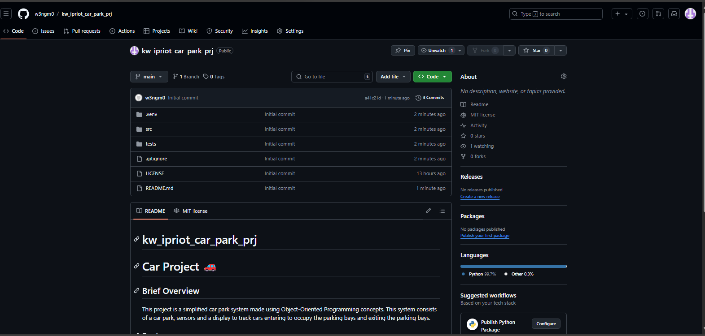
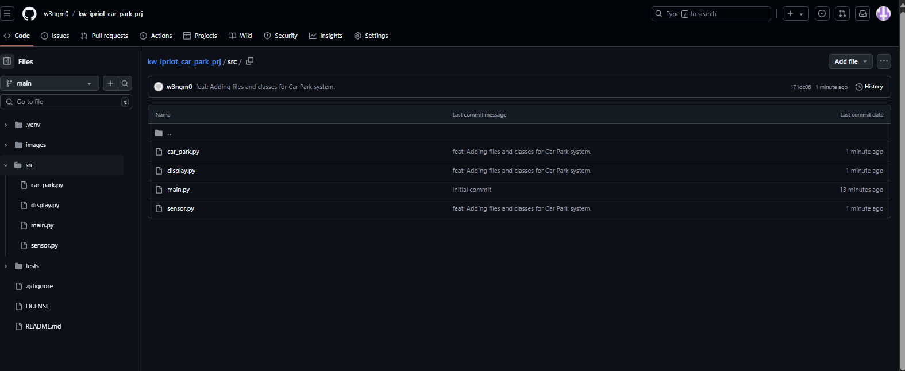
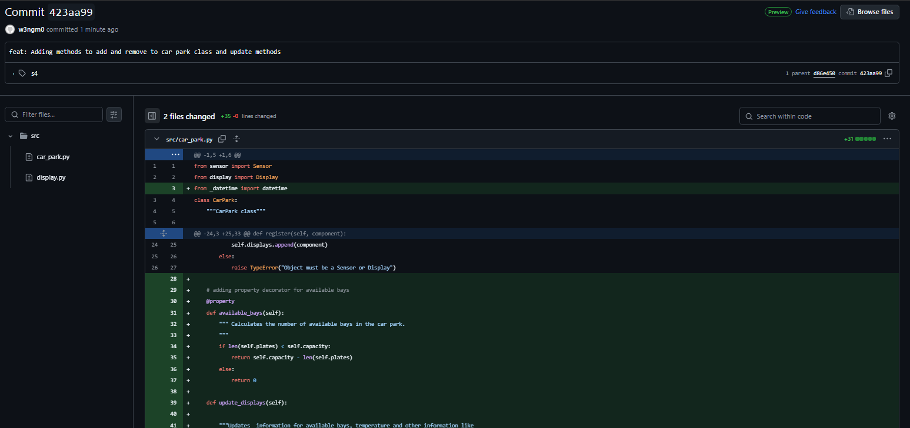
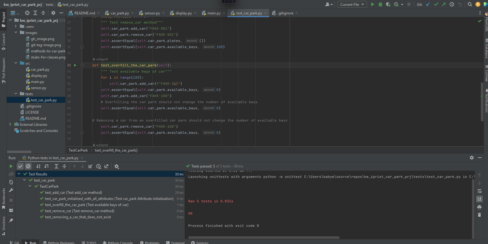

# kw_ipriot_car_park_prj

# Car Project 🚗

## Brief Overview
This project is a simplified car park system made using Object-Oriented Programming concepts. 
This system consists of a car park, sensors and a display to track cars entering to occupy 
the parking bays and exiting the parking bays.


## Features
- Car Park: Will contain the nuber of parking bays and their availability.
- Sensors : Use sensor objects to detect a cars movement as it enters and leaves the bay 
- Displays: Will display the number of available parking bays relying on the sensor.


## Installation of Project 
To get started with the project, you can follow these steps:

1. Clone the repository:
   ```bash
   git clone https://github.com/w3ngm0/ipriot_car_park_prj.git


### Images and Additional Evidencing



| Class Name   | Attributes                             | Methods                              |
|--------------|----------------------------------------|--------------------------------------|
| `CarPark`    | capacity, available_bays, plates_id    | add_car, remove_car , is_full        |
| `Sensor`     | sensor_id, sensor_position(entry/exit) | detect_car, reset_sensor             |
| `Display`    | message , location (entry or exit)     | show_display, update_display_message |

### Updated src file with classes


>Q. Which class is responsible for the number of available bays (and why)?
> The CarPark class because we need to know how many bays are present every time a car 
> enters or exits the car park.
> 
>Q. Which class is responsible for the current temperature (and why)?
> The Display class will display the current temperature 
> depending  on the  method the handled by either the sensor or car_park class.
> 
>Q. Which class is responsible for the time (and why)?
> Similarly the display class will again be responsible for displaying the time 
> depending on the class that will handle the methods it should then update the display to user.
--------

### Tag s4 : Methods to car park


Answer the following questions:
> **Review Questions**
>
> 1. **Which class is responsible for each of the following pieces of information (and why)?**
>    - _The number of available bays_
>      `The car park class is responsible, because it directly manages the capacity and the 
       > plates of parked cars. The available bays are calculated based on its attributes.
>       The abailable_bays property calculates difference between the total capacity and the 
       > number of parked cars handling the informtion. `
>    - _The current temperature_
>      `Sensor class is responsible because it retrieves temeperature from the environment. 
       > Sensors are used to gather environmental data so the Sensor class would likely 
       > fetch the current temperature.`
>    - _The time_
>      `The datetime module is responsible because it provides the current system time. The 
       > time information comes from the datetime module itself and the CarPark class uses 
       > this datetime as the source for time.`
>
> 2. **What is the difference between an attribute and a property?**
>    `An attribute is a variable that is associated with an object or class. Whereas, A 
     > property is a special kind of attribute that provides mechanism to add logic whtn the 
     > attribute is accessed or modified. Attributes are used to store data or state related 
     > to object and it is directly accessed and set like 'location = "Unknown" '. There are 
     > two types of attributes class and instance attribute and an instance attribute 
     > defines the class body using self keyword usually the __init__ method. And properties 
     > uses @property decorator whch can help define getters(__get__) and setters (__set__).`
>
> 3. **Why do you think we used a dictionary to hold the data we passed the display? List at least one advantage and one disadvantage of this approach.**
>    `A dictionary was used to pass data of key, value pairs to the Display because 
     > dictionaries can easily allow new fields without requiring changes to method 
     > signartures or the Display class interface. If I later want to add some other values 
     > like humidity I can do so without altering existing code and pass the data easily. 
      `
### Unit Tests Evidencing



