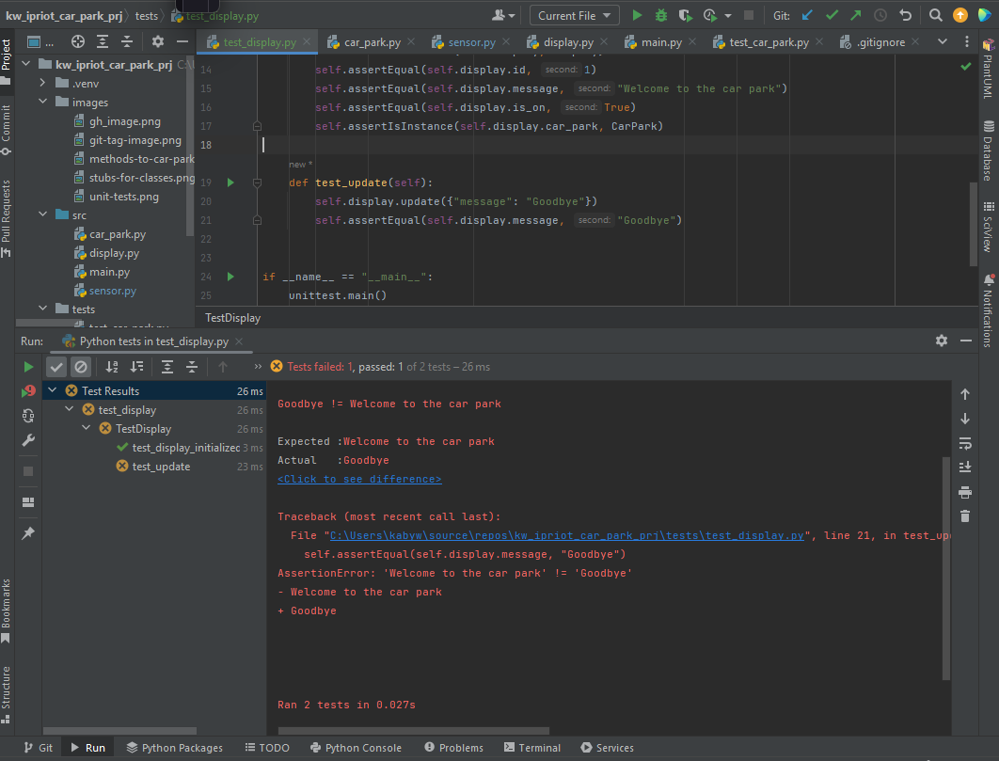
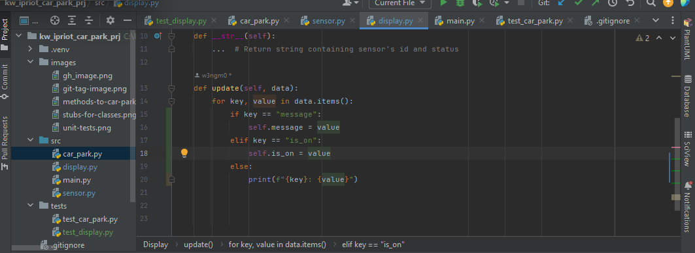
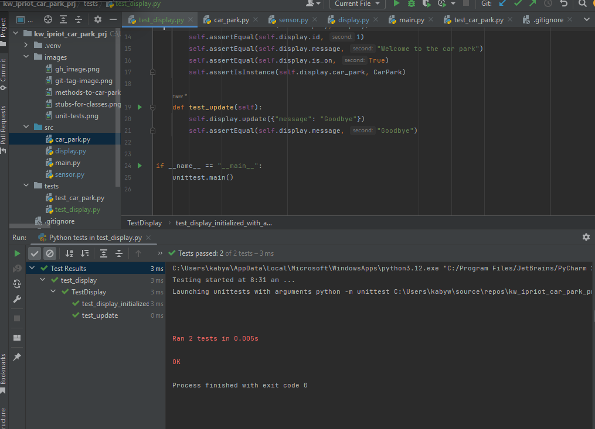
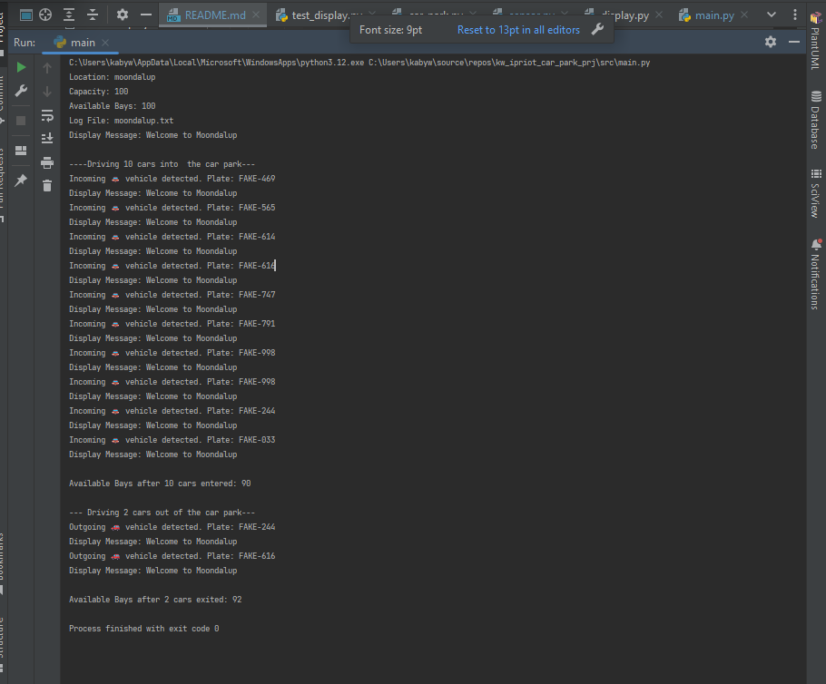
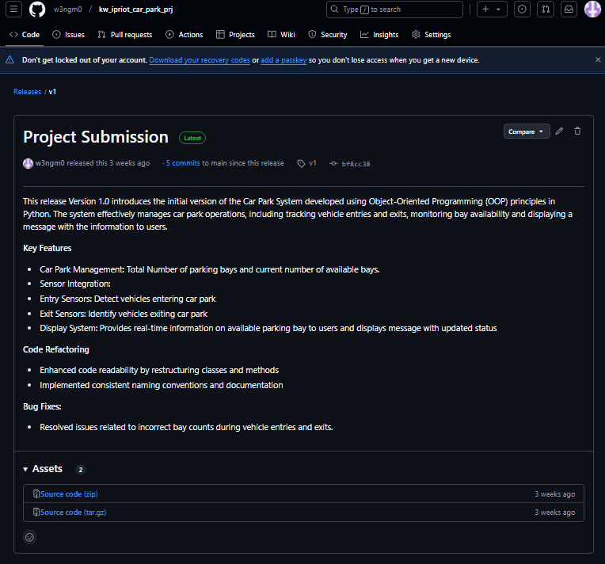

# kw_ipriot_car_park_prj

# Car Park Management System 🚗

## Brief Overview
The Car Park Management System or project is a simplified car park system made using 
Object-Oriented Programming concepts. 
This system consists of a car park, sensors and a display to track cars entering to occupy 
the parking bays and exiting the parking bays.


## Key Features
- Car Park: Tracks the total capacity of parking bays and updates available bays
- Sensors : Use sensor objects to detect a cars movement as it enters and leaves the bay 
- Displays: Outputs and displays the number of available parking bays relying on the sensor


## Installation of Project 
### Prerequisites
* Python 3.8 or later
* Git 

### Steps to Install
To get started with the project, you can follow these steps:

1. Clone the repository - 
    Use the following command to clone the project to your local machine: 
    ```bash
   git clone https://github.com/w3ngm0/ipriot_car_park_prj.git

### Run the Application 
To run the application execute the main script to start the simulation: 
    
    main.py 


### Images and Additional Evidencing


| Class Name   | Attributes                                                 | Methods                                                                                                                       |
|--------------|------------------------------------------------------------|-------------------------------------------------------------------------------------------------------------------------------|
| `CarPark`    | location, capacity, plates, sensors, log_file, config_file | register(), add_car(), remove_car() , update_displays(), available_bays(), _log_car_activity(), write_config(), from_config() |
| `Sensor`     | id, is_active, car_park                                    | update_car_park(), _scan_plate(), detect_vehicle()                                                                            |
| `Display`    | id, car_park, message, is_on                               | update()                                                                                                                      |

### Updated src file with classes


>Q. Which class is responsible for the number of available bays (and why)?
> The CarPark class because we need to know how many bays are present every time a car 
> enters or exits the car park.
> 
>Q. Which class is responsible for the current temperature (and why)?
> The Display class will display the current temperature 
> depending  on the  method the handled by either the sensor or car_park class.
> 
>Q. Which class is responsible for the time (and why)?
> Similarly the display class will again be responsible for displaying the time 
> depending on the class that will handle the methods it should then update the display to user.
--------

### Tag s4 : Methods to car park


Answer the following questions:
> **Review Questions**
>
> 1. **Which class is responsible for each of the following pieces of information (and why)?**
>    - _The number of available bays_
>      `The car park class is responsible, because it directly manages the capacity and the 
       > plates of parked cars. The available bays are calculated based on its attributes.
>       The abailable_bays property calculates difference between the total capacity and the 
       > number of parked cars handling the informtion. `
>    - _The current temperature_
>      `Sensor class is responsible because it retrieves temeperature from the environment. 
       > Sensors are used to gather environmental data so the Sensor class would likely 
       > fetch the current temperature.`
>    - _The time_
>      `The datetime module is responsible because it provides the current system time. The 
       > time information comes from the datetime module itself and the CarPark class uses 
       > this datetime as the source for time.`
>
> 2. **What is the difference between an attribute and a property?**
>    `An attribute is a variable that is associated with an object or class. Whereas, A 
     > property is a special kind of attribute that provides mechanism to add logic whtn the 
     > attribute is accessed or modified. Attributes are used to store data or state related 
     > to object and it is directly accessed and set like 'location = "Unknown" '. There are 
     > two types of attributes class and instance attribute and an instance attribute 
     > defines the class body using self keyword usually the __init__ method. And properties 
     > uses @property decorator whch can help define getters(__get__) and setters (__set__).`
>
> 3. **Why do you think we used a dictionary to hold the data we passed the display? List at least one advantage and one disadvantage of this approach.**
>    `A dictionary was used to pass data of key, value pairs to the Display because 
     > dictionaries can easily allow new fields without requiring changes to method 
     > signartures or the Display class interface. If I later want to add some other values 
     > like humidity I can do so without altering existing code and pass the data easily. 
      `
### Unit Tests Evidencing


### Unit Test Evidencing - Test Display Class




> AssertionError: "Welcome to the car park" != "Goodbye"
> The test update assets the message equals goodbye but the attribute retains the value 
> "Welcome to the car park". This issue is occurring because our method for update in 
> Display class does not modify the message attribute correctly.
> Our old method simply just printed the key, value pair in our data dictionary without 
> updating the message attributes. 
> The method needs to be modified to handle the message attribute properly:
> Making sure the method checks for specific keys in the data dictionary, e.g. "message" and 
> "is_on". 
> If the key matches an attribute of the Display class, it updates the attributes with 
> corresponding values. 


### Test the car park register method

> The car park register method should accept a `Sensor` or `Display` object. It should raise 
> a `TypeError` if the object is neither a `Sensor` nor a `Display`. Before proceeding, think about where you would test this behaviour. Should you test it in the `CarPark` unit tests or the `Sensor` unit tests? Why?

> The register method is a part of the CarPark class so its behaviour is related to how the 
> CarPark interacts with Sensor and Display objects. So it should be tested in the CarPark 
> unit tests not the Sensor unit test. This will help us ensure that the functionality of 
> CarPark class is working as expected.

### Storing configuration of a car park in a file called config.json


# Running the car park
> In my src/main.py running main.py gives me: 
> 


## Release Version 


# Conclusion 
This project demonstrates a Car Park Management system using Python, with Key components. 

## License 
This project is licensed under the MIT license


